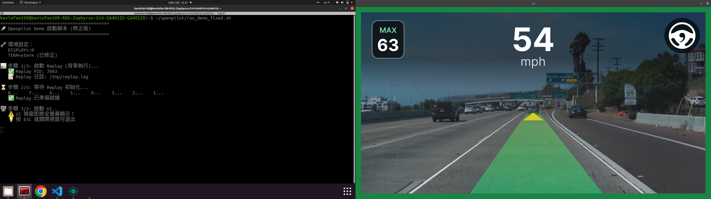
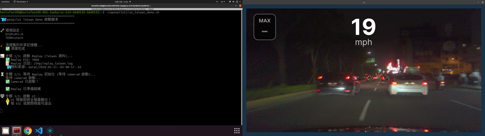

# PDF 轉換說明

## 🎯 轉換 Markdown 到 PDF 的三種方法

---

## 方法一：使用提供的批次檔（推薦）

### 步驟

1. **雙擊執行** `convert_to_pdf.bat`
2. 腳本會自動檢查環境並進行轉換
3. 轉換完成後可選擇開啟 PDF

### 前置需求

需要安裝以下軟體：

#### 1. Pandoc
- **下載：** https://pandoc.org/installing.html
- **Windows 安裝程式：** pandoc-3.x.x-windows-x86_64.msi
- **安裝後驗證：**
  ```bash
  pandoc --version
  ```

#### 2. MiKTeX（LaTeX 引擎）
- **下載：** https://miktex.org/download
- **選擇：** Basic MiKTeX Installer (約 200 MB)
- **安裝選項：** 選擇「自動安裝缺少的套件」
- **安裝後驗證：**
  ```bash
  xelatex --version
  ```

### 優點
- ✅ 自動化處理
- ✅ 支援中文
- ✅ 格式精美
- ✅ 自動生成目錄

### 缺點
- ❌ 需要安裝約 500 MB 軟體

---

## 方法二：線上轉換工具（最簡單）

如果不想安裝軟體，可以使用線上工具：

### 推薦工具

#### 1. **Markdown to PDF** (推薦)
- **網址：** https://www.markdowntopdf.com/
- **特點：** 支援中文、程式碼高亮
- **步驟：**
  1. 開啟 `AI_Project_One_Report.md`
  2. 複製全部內容
  3. 貼上到網站
  4. 點擊「Convert」
  5. 下載 PDF

#### 2. **CloudConvert**
- **網址：** https://cloudconvert.com/md-to-pdf
- **特點：** 專業、支援多種格式
- **步驟：**
  1. 上傳 `AI_Project_One_Report.md`
  2. 選擇輸出格式為 PDF
  3. 點擊「Start Conversion」
  4. 下載 PDF

#### 3. **DILLINGER**
- **網址：** https://dillinger.io/
- **特點：** 即時預覽
- **步驟：**
  1. 將 Markdown 內容貼上
  2. 點擊「Export as」→「PDF」

### 優點
- ✅ 不需安裝任何軟體
- ✅ 即時轉換
- ✅ 跨平台

### 缺點
- ❌ 需要網路連線
- ❌ 格式控制較少
- ❌ 可能有檔案大小限制

---

## 方法三：使用 VSCode 插件

如果你已經在使用 VSCode：

### 步驟

1. **安裝插件：** Markdown PDF
   - 在 VSCode 中按 `Ctrl+Shift+X`
   - 搜尋「Markdown PDF」
   - 點擊安裝

2. **轉換：**
   - 開啟 `AI_Project_One_Report.md`
   - 按 `Ctrl+Shift+P`
   - 輸入「Markdown PDF: Export (pdf)」
   - 按 Enter

3. **PDF 會自動生成在同一目錄**

### 優點
- ✅ VSCode 內建整合
- ✅ 簡單快速
- ✅ 支援中文

### 缺點
- ❌ 格式較陽春
- ❌ 目錄生成功能較弱

---

## 方法四：Markdown → Word → PDF

如果你有 Microsoft Word：

### 步驟

1. **使用 Pandoc 轉 Word：**
   ```bash
   pandoc AI_Project_One_Report.md -o AI_Project_One_Report.docx
   ```

2. **在 Word 中開啟 .docx 檔案**

3. **調整格式：**
   - 設定字型（微軟正黑體）
   - 調整標題樣式
   - 加入封面頁

4. **匯出為 PDF：**
   - 檔案 → 另存新檔 → PDF

### 優點
- ✅ 可以手動調整格式
- ✅ 完全控制排版
- ✅ 熟悉的操作介面

### 缺點
- ❌ 需要手動調整
- ❌ 較花時間

---

## 🎨 轉換後的檢查清單

轉換成 PDF 後，請檢查：

- [ ] 封面頁正確（標題、姓名、學號）
- [ ] 目錄完整（所有章節）
- [ ] 中文正常顯示（無亂碼）
- [ ] 程式碼區塊格式正確
- [ ] 表格對齊
- [ ] 圖片位置（如果有插入截圖）
- [ ] 頁碼正常
- [ ] 超連結可點擊（如果需要）

---

## 📝 補充截圖的方法

報告中有兩處標示「待補充截圖」：

### 位置
1. **第 4.2 節** - USA Demo 執行畫面
2. **第 4.3 節** - Taiwan Demo 執行畫面

### 如何插入

#### 在 Markdown 中插入：

```markdown

```

#### 步驟：

1. **建立圖片目錄：**
   ```bash
   mkdir images
   ```

2. **將截圖放入 images 目錄：**
   - `usa_demo_screenshot.png`
   - `taiwan_demo_screenshot.png`

3. **在 Markdown 中加入：**

   在 `### 4.2 USA Demo 測試結果` 的 `> [待補充]` 處改為：
   ```markdown
   
   *圖 4.1：USA Demo 執行畫面 - 顯示 TOYOTA RAV4 行駛於加州高速公路*
   ```

   在 `### 4.3 Taiwan Demo 測試結果` 的 `> [待補充]` 處改為：
   ```markdown
   
   *圖 4.2：Taiwan Demo 執行畫面 - 顯示 TOYOTA PRIUS 行駛於台灣道路*
   ```

4. **重新轉換 PDF**

---

## 🆘 常見問題與解決

### Q1: 轉換後中文是亂碼

**原因：** 字型不支援中文

**解決：**
- 方法一：使用 xelatex 引擎（已在批次檔中設定）
- 方法二：手動指定中文字型
  ```bash
  -V CJKmainfont="Microsoft YaHei"
  ```

### Q2: 轉換失敗，提示 xelatex 錯誤

**原因：** 未安裝 LaTeX

**解決：** 安裝 MiKTeX 或使用線上工具（方法二）

### Q3: 程式碼區塊格式跑掉

**原因：** PDF 引擎不支援語法高亮

**解決：**
- 使用 `--highlight-style=tango` 參數
- 或在 Markdown 中移除語言標示（```bash → ```）

### Q4: 表格超出頁面

**原因：** 表格內容過長

**解決：**
- 方法一：縮短表格內容
- 方法二：使用 Word 手動調整（方法四）
- 方法三：將表格旋轉 90 度（landscape）

### Q5: 檔案太大

**原因：** 包含大量圖片或高解析度截圖

**解決：**
- 壓縮圖片（建議寬度 1200px 以下）
- 使用 PNG 而非 BMP
- 使用線上工具壓縮 PDF

---

## 📞 需要幫助？

如果轉換過程遇到問題：

1. **檢查錯誤訊息** - 通常會提示缺少什麼
2. **確認軟體版本** - Pandoc 3.x, MiKTeX 最新版
3. **嘗試線上工具** - 最簡單的備選方案
4. **使用 Word 轉換** - 最穩定的方案

---

## ✅ 推薦方案總結

| 情境 | 推薦方法 | 原因 |
|------|---------|------|
| 第一次轉換 | **方法二（線上工具）** | 不需安裝，立即使用 |
| 需要精美格式 | **方法一（批次檔）** | 專業排版，自動目錄 |
| 經常轉換 | **方法三（VSCode）** | 整合開發環境 |
| 需要手動調整 | **方法四（Word）** | 完全控制 |

---

**建議：** 先用線上工具快速看效果，滿意後再安裝 Pandoc 生成最終版本。
